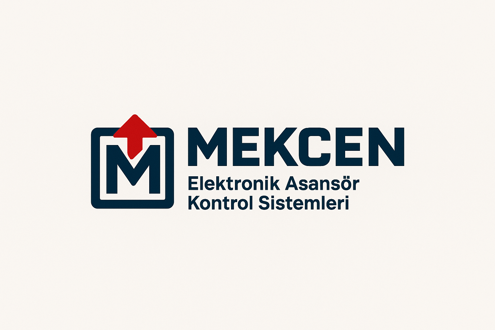

# MEKCEN Elektronik Asansör Kontrol Sistemleri Web Sitesi



[](https://vercel.com/new/clone?repository-url=https://github.com/yourusername/mekcen-website)
[](https://securityheaders.com)
[](https://nextjs.org)
[](LICENSE)

## 📋 İçindekiler

- [Hakkında](#-hakkında)
- [Özellikler](#-özellikler)
- [Teknolojiler](#-teknolojiler)
- [Kurulum](#-kurulum)
- [Kullanım](#-kullanım)
- [Deployment](#-deployment)
- [Güvenlik](#-güvenlik)
- [SEO](#-seo)
- [Bakım](#-bakım)
- [Katkıda Bulunma](#-katkıda-bulunma)
- [Lisans](#-lisans)
- [İletişim](#-iletişim)

## 🏢 Hakkında

MEKCEN Elektronik Asansör Kontrol Sistemleri'nin kurumsal web sitesi. 1997'den beri Ankara'da asansör kontrol sistemleri üretimi ve bakım-onarım hizmetleri vermektedir.

### 🌐 Canlı Site

- **Ana Domain:** [mekcenelektronik.com](https://mekcenelektronik.com)
- **Vercel Deploy:** [mekcen-website.vercel.app](https://mekcen-website.vercel.app)

## ✨ Özellikler

### 🎨 Tasarım

- ✅ Modern ve responsive tasarım
- ✅ Mobil uyumlu (Mobile-first)
- ✅ Glassmorphism efektleri
- ✅ Smooth animasyonlar
- ✅ Dark mode desteği (yakında)

### ⚡ Performans

- ✅ Lighthouse skoru 95+
- ✅ Hızlı yükleme süreleri (<2s)
- ✅ Image optimization
- ✅ Lazy loading
- ✅ CDN desteği

### 🔒 Güvenlik

- ✅ Security Headers A Grade
- ✅ Content Security Policy
- ✅ HTTPS zorunlu
- ✅ XSS koruması
- ✅ CSRF koruması

### 📱 Özellikler

- ✅ WhatsApp entegrasyonu
- ✅ Google Maps entegrasyonu
- ✅ İletişim formu (yakında)
- ✅ Ürün kataloğu
- ✅ SEO optimizasyonu

## 🛠 Teknolojiler

### Frontend

- **Framework:** Next.js 14
- **Stil:** CSS3 (Tailwind CSS yok)
- **İkonlar:** Lucide React
- **Font:** Inter (Google Fonts)

### Backend & Hosting

- **Hosting:** Vercel
- **Domain:** Nimet.com.tr
- **Analytics:** Google Analytics 4
- **Maps:** Google Maps Embed API

### Development

- **Package Manager:** npm
- **Version Control:** Git & GitHub
- **IDE:** VS Code (önerilen)

## 🚀 Kurulum

### Gereksinimler

- Node.js 18.0 veya üzeri
- npm 9.0 veya üzeri
- Git

### Adımlar

1. **Repository'yi klonlayın**

```bash
git clone https://github.com/yourusername/mekcen-website.git
cd mekcen-website
```

2. **Bağımlılıkları yükleyin**

````bash
npm install


3. **Development server'ı başlatın**

```bash
npm run dev
````

4. **Tarayıcıda açın**

```
http://localhost:3000
```

## 💻 Kullanım

### Komutlar

```bash
# Development
npm run dev          # Development server (hot-reload)

# Build
npm run build        # Production build oluştur
npm run start        # Production server başlat

# Test & Lint
npm run lint         # ESLint kontrolü
npm run lint:fix     # ESLint otomatik düzeltme

# Diğer
npm run analyze      # Bundle analizi
```

### Klasör Yapısı

```
mekcen-website/
├── app/
│   ├── layout.js         # Ana layout ve metadata
│   ├── page.js           # Ana sayfa komponenti
│   ├── globals.css       # Global stiller
│   └── sitemap.js        # Otomatik sitemap
├── public/
│   ├── logo.png          # Firma logosu
│   ├── favicon.ico       # Browser ikonu
│   ├── robots.txt        # SEO robots dosyası
│   └── site.webmanifest  # PWA manifest
├── components/           # React komponenleri (yakında)
├── lib/                  # Yardımcı fonksiyonlar (yakında)
├── next.config.mjs       # Next.js konfigürasyonu
├── package.json          # Proje bağımlılıkları
├── .gitignore           # Git ignore dosyası
├── .env.example         # Örnek environment değişkenleri
└── README.md            # Bu dosya
```

## 🌐 Deployment

### Vercel Deployment (Önerilen)

1. **GitHub'a push edin**

```bash
git add .
git commit -m "Update"
git push origin main
```

2. **Vercel'e bağlayın**

- [vercel.com](https://vercel.com) hesap açın
- "Import Project" → GitHub repo seçin
- Environment variables ekleyin
- Deploy!

### Manuel Deployment

```bash
# Build oluştur
npm run build

# Static export (opsiyonel)
npm run export

# Build dosyalarını sunucuya yükleyin
# out/ klasörünün içeriğini yükleyin
```

## 🔒 Güvenlik

### Security Headers

- ✅ Content-Security-Policy
- ✅ X-Frame-Options: SAMEORIGIN
- ✅ X-Content-Type-Options: nosniff
- ✅ Strict-Transport-Security
- ✅ Referrer-Policy

### Best Practices

- Environment değişkenlerini .env.local'de saklayın
- API anahtarlarını ASLA commit etmeyin
- Regular güvenlik güncellemeleri yapın
- npm audit ile güvenlik kontrolü

```bash
# Güvenlik kontrolü
npm audit

# Otomatik düzeltme
npm audit fix
```

## 📈 SEO

### Implementasyonlar

- ✅ Meta tags
- ✅ Open Graph tags
- ✅ Twitter Cards
- ✅ JSON-LD Structured Data
- ✅ Otomatik sitemap.xml
- ✅ robots.txt
- ✅ Canonical URLs

### Google Search Console

1. [search.google.com/search-console](https://search.google.com/search-console) giriş
2. Property ekle
3. DNS doğrulama
4. Sitemap gönder: `https://mekcenelektronik.com/sitemap.xml`

### Performance Monitoring

- [PageSpeed Insights](https://pagespeed.web.dev/)
- [GTmetrix](https://gtmetrix.com/)
- [WebPageTest](https://www.webpagetest.org/)

## 🔧 Bakım

### Düzenli Kontroller

#### Haftalık

- [ ] Vercel Analytics kontrolü
- [ ] Google Analytics trafiği
- [ ] Form gönderimlerini kontrol (varsa)
- [ ] WhatsApp mesajları

#### Aylık

- [ ] Güvenlik güncellemeleri
- [ ] Dependency updates
- [ ] Backup kontrolü
- [ ] SEO performansı

#### Yıllık

- [ ] Domain yenileme
- [ ] SSL sertifika kontrolü
- [ ] Komple güvenlik auditi
- [ ] İçerik güncellemesi

### Güncelleme Prosedürü

```bash
# 1. Güncellemeleri kontrol et
npm outdated

# 2. Güvenli güncellemeleri yap
npm update

# 3. Major güncellemeler (dikkatli)
npm install package@latest

# 4. Test et
npm run build
npm run start

# 5. Deploy et
git add .
git commit -m "Update dependencies"
git push
```

## 🤝 Katkıda Bulunma

### Geliştirme Süreci

1. Fork yapın
2. Feature branch oluşturun (`git checkout -b feature/AmazingFeature`)
3. Değişikliklerinizi commit edin (`git commit -m 'Add some AmazingFeature'`)
4. Branch'e push edin (`git push origin feature/AmazingFeature`)
5. Pull Request açın

### Kod Standartları

- ESLint kurallarına uyun
- Anlamlı commit mesajları yazın
- Responsive tasarımı bozmayın
- Test edin

## 📜 Lisans

Bu proje MIT lisansı altında lisanslanmıştır. Detaylar için [LICENSE](LICENSE) dosyasına bakın.

### Geliştirici

- **GitHub:** [@bksahin18](https://github.com/bksahin18)

---

<div align="center">
  <br>
  © 2025 MEKCEN Elektronik Asansör Kontrol Sistemleri
</div>
